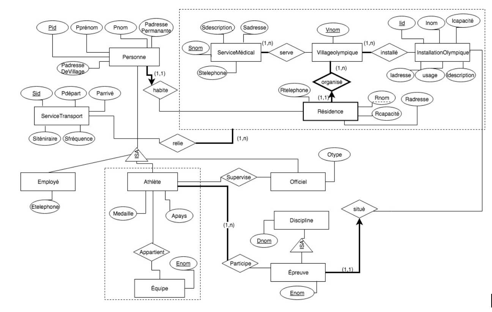

# Final-Database-Project 

This repository contains the final project for the Databases I class, Development of a database application.

### Diagram



### Setup

Please follow those instruction fto set up your local machine. 

1. Download xampp: https://www.apachefriends.org/download.html 
2. Find and open ```php.ini``` in xampp file. For mac : ```application/xampp/etc``` and for windows it should be located at ```c:\xampp\php```
3. Add those lines to the end in your ```php.ini```. 
   - For mac: ```extension=pgsql.so```
   - For windows: ```extension=php_pdo_pgsql.dll``` and ```extension=php_pgsql.dll```
4. Pull this repository to your machine and make sure to locate at xampp/htdocs
3. Open postgres and create a new server. (```name= doesn't matter```, ```hostname= localhost```, ```port= 5433```, ```username=postgres``` , ```password=admin```) <br /> 
make sure that under ```login/group Roles``` at the bottom ```postgres```, the connection limit is different than -1, it can be set to 10. 
4. Create a database named ```cojoDatabase```. 
5. Open query tool in cojoDatabase databse and execute the two files in ```/Applications/XAMPP/xamppfiles/htdocs/Final-Database-Project/sql``` (windows: ```c:\xampp\htdocs\Final-Database-Project\sql```): createSchema then createData. 

### Running the Webserver

1. Open xampp and go to manage servers and start Apache web server.
2. navigate to http://localhost/Final-Database-Project/ and you are all set :D

N.B: if you created a new folder named ```example``` to pull the repository to it, make sure to add the name of the folder in your URL (e.g: http://localhost/example/Final-Database-Project/)
